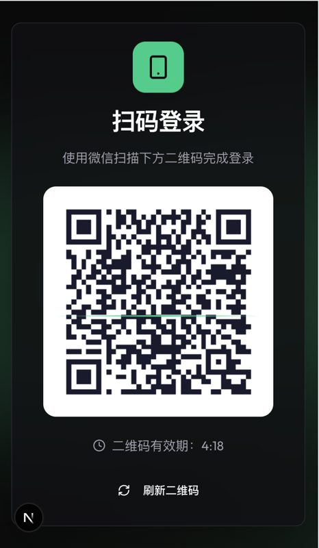
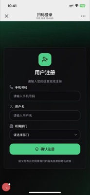
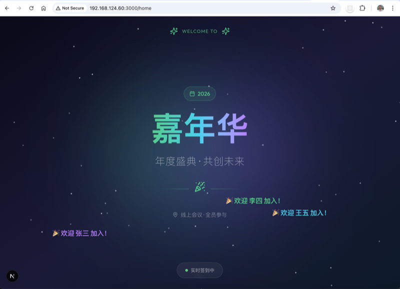
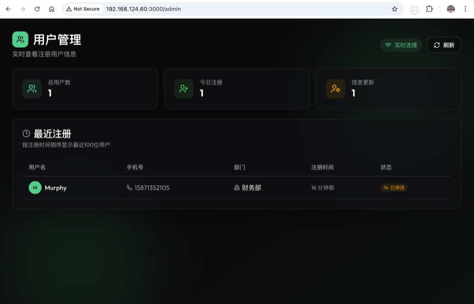

# ScanSign - 扫码签到系统

一个基于 H5 页面的扫码签到登录解决方案，支持会议签到、弹幕欢迎、实时用户管理。

## 技术栈

- ⚛️ **Framework** - Next.js 15 (App Router)
- 📝 **Language** - TypeScript
- 🎨 **Styling** - Tailwind CSS v4
- 🧩 **Components** - Shadcn-ui
- ✅ **Schema Validations** - Zod
- 🗂️ **State Management** - Zustand

## 功能特点

- 🔐 生成唯一 Token 的二维码
- 📱 H5 页面收集用户信息（用户名、手机号、部门）
- 🔄 PC 端实时轮询检测登录状态
- ⏱️ 二维码自动过期机制（5分钟）
- 🎉 会议首页弹幕欢迎效果
- 👥 后台实时用户管理
- 🔁 老用户识别与信息回显
- ✨ 精美的暗色主题 UI 设计

## 页面截图

### 扫码登录页

PC 端二维码登录入口



### H5 注册页面

手机端信息填写界面



### 会议首页

大屏展示，实时弹幕欢迎新用户



### 后台管理

实时用户列表和统计



## 使用指南

### 页面一览

| 页面 | 地址 | 说明 |
|------|------|------|
| 扫码登录 | `/` | PC 端扫码入口页面 |
| 会议首页 | `/home` | 显示会议主题和欢迎弹幕 |
| 用户注册 | `/mobile/confirm?token=xxx` | 手机端信息填写页面 |
| 后台管理 | `/admin` | 实时查看注册用户列表 |

### 完整使用流程

#### 1️⃣ 管理员准备

1. 启动服务后，在大屏幕上打开 **会议首页** (`/home`)
2. 另开一个浏览器窗口打开 **后台管理** (`/admin`) 监控注册情况

#### 2️⃣ 用户签到

1. 用户在自己的电脑/平板上访问 **扫码登录页** (`/`)
2. 使用微信扫描页面上的二维码
3. 手机上打开 H5 页面，填写信息：
   - 📱 手机号码
   - 👤 用户名
   - 🏢 所属部门
4. 点击「确认注册」完成签到

#### 3️⃣ 签到成功

- **PC 端**：自动跳转到会议首页 (`/home`)
- **会议首页**：滚动显示 "🎉 欢迎 xxx 加入！" 弹幕
- **后台管理**：实时显示新注册用户，并弹出提醒

#### 4️⃣ 老用户再次签到

1. 输入手机号后自动识别为老用户
2. 回显上次注册的用户名和部门
3. 可直接确认登录，或修改信息后提交
4. PC 端跳转到会议首页

### 防重复机制

- **手机号唯一**：同一手机号只能注册一次，再次扫码显示已有信息
- **用户名+部门唯一**：同一部门内不允许重名

## 快速开始

### 安装依赖

```bash
npm install
```

### 开发模式

```bash
npm run dev
```

访问 http://localhost:3000 查看登录页面

### 生产构建

```bash
npm run build
npm run start
```

## 项目结构

```
src/
├── app/
│   ├── api/
│   │   ├── qrcode/
│   │   │   ├── generate/        # 生成二维码
│   │   │   ├── status/[token]/  # 查询登录状态
│   │   │   └── confirm/         # 确认登录
│   │   ├── user/
│   │   │   ├── check/           # 检查手机号是否已注册
│   │   │   ├── check-username/  # 检查用户名重复
│   │   │   ├── list/            # 获取用户列表
│   │   │   └── stream/          # SSE 实时推送
│   │   └── departments/         # 获取部门列表
│   ├── home/                    # 会议首页（弹幕）
│   ├── admin/                   # 后台管理页面
│   ├── mobile/confirm/          # H5 信息收集页面
│   ├── success/                 # 登录成功页面
│   ├── page.tsx                 # PC 端扫码登录页面
│   ├── layout.tsx
│   └── globals.css
├── components/ui/               # Shadcn-ui 组件
├── lib/
│   ├── utils.ts                 # 工具函数
│   ├── session-store.ts         # 会话存储（内存）
│   └── user-store.ts            # 用户存储（内存）
├── store/
│   └── login-store.ts           # Zustand 状态管理
└── types/
    └── index.ts                 # TypeScript 类型定义
```

## API 接口

### 二维码相关

#### POST /api/qrcode/generate
生成新的二维码

**响应:**
```json
{
  "success": true,
  "data": {
    "token": "uuid-string",
    "qrCodeUrl": "data:image/png;base64,...",
    "expiresAt": 1702547200000
  }
}
```

#### GET /api/qrcode/status/[token]
查询登录状态

**响应:**
```json
{
  "success": true,
  "data": {
    "status": "pending | confirmed | expired",
    "userInfo": {
      "username": "用户名",
      "phone": "13800138000",
      "departmentId": "tech",
      "departmentName": "技术部",
      "isNewUser": true,
      "submittedAt": 1702547200000
    }
  }
}
```

#### POST /api/qrcode/confirm
确认登录并提交用户信息

**请求体:**
```json
{
  "token": "uuid-string",
  "username": "用户名",
  "phone": "13800138000",
  "departmentId": "tech",
  "existingUserId": "可选，老用户更新时传入"
}
```

### 用户相关

#### POST /api/user/check
检查手机号是否已注册

#### POST /api/user/check-username
检查用户名+部门是否重复

#### GET /api/user/list
获取用户列表

#### GET /api/user/stream
SSE 实时推送用户注册/更新事件

#### GET /api/departments
获取部门列表

## 环境变量

```env
# 应用基础URL（用于生成二维码中的H5链接）
NEXT_PUBLIC_BASE_URL=http://localhost:3000
```

## 生产环境注意事项

1. **数据存储**: 当前使用内存存储，生产环境建议使用 Redis 或数据库
2. **域名配置**: 需要配置正确的 `NEXT_PUBLIC_BASE_URL`
3. **HTTPS**: 生产环境必须使用 HTTPS
4. **跨域配置**: 在 `next.config.ts` 中配置 `allowedDevOrigins`
5. **用户验证**: 可根据需求添加短信验证码等额外验证

## 自定义配置

### 修改会议主题

编辑 `src/app/home/page.tsx` 中的标题内容：

```tsx
<h1>嘉年华</h1>
<p>年度盛典 · 共创未来</p>
```

### 修改部门列表

编辑 `src/lib/user-store.ts` 中的 `DEPARTMENTS` 数组：

```typescript
export const DEPARTMENTS: Department[] = [
  { id: "tech", name: "技术部" },
  { id: "product", name: "产品部" },
  // 添加更多部门...
];
```

## License

MIT
